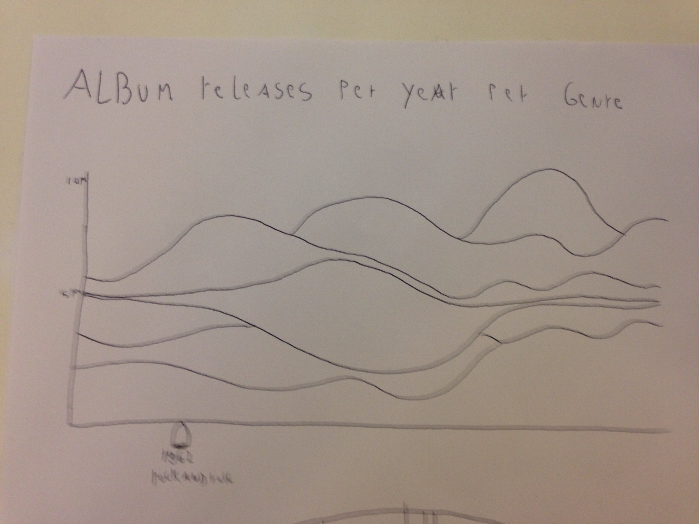

# programmeerproject

Mike La Grouw, 10626700

# de ontwikkeling van populariteit van muziekgenres in de 20e eeuw

# probleemstelling

met de snelle ontwikkelingen in de 20e eeuw in de media en kunst en cultuursectoren is het gemakkelijk om snel in de war te raken over welke stromingen in bepaalde decennia populair of alweer uitgedoofd waren. vele kunstliefhebbers vinden het echter interessant om over de populariteit van de stromingen geinformeerd te worden en zo zal het voor muziekliefhebbers specifiek interessant zijn om de populariteit van vele muziekstromingen van de 20e eeuw in een mooie visualisatie te kunnen bekijken. ook kan als de populariteit van verschillende muziekstromen per jaar makkelijk gevisualiseerd is goed gespeculeerd worden over de redenen van populariteit vanuit een historisch oogpunt (bijv. de komst van de blues door slavernij en de opkomst van protestliedeen in rock en folk tijdens de vietnam oorlog).

# visualisatie

in de visualisatie die gemaakt zal worden komen een aantal grafieken aan bod om de vele muziekstijlen te visualiseren. ten eerste zal als hoofdgrafiek een stream chart worden gemaakt die laat zien hoeveel albums er van bepaalde overkoepelende genres(blues, rock, dance, psychedelic, jazz, country, hip hop) per jaar werden uitgebracht (data zal uit verschillende lijsten van albums per genre van wikipedia worden gehaald). als er op een van de oppervlakten voor een bepaald genre wordt geklikt zal er een bar graph verschijnen met de 10 best verkochte albums uit dit genre met een mousover tooltip functie die het jaar waarin het album uitgebracht is en de totale verkoop van het album zal laten zien. ook zal er een bilevel partition chart in de visualisatie zichtbaar zijn waar van alle overkoepelende genres in het eerste level de subgenres die op wikipedia te vinden zijn zal laten zien in het tweede level, waarin een mousover over een van de vlakken in de levels zal laten zien rond welk jaar de release van de albums zich centreerde (mediaan van de jaartallen van de releases). op deze manier wordt vooral gekeken naar hoe populair de muziekstijlen waren binnen de muzikale kringen (wat brachten muzikanten toen voor albums uit?) en via de barchart naar commerciele kringen(hoe verkochten deze albums?)

# streamchart

# bilevel pie chart

# bar chart

de datasets die voor deze visualistatie gebruikt worden zijn verschillende datasets van wikipedia. ook al bevat wikipedia natuurlijk geen pagina van alle ooit uitgebrachte muziekalbums, staan er toch veel albums op. deze albums staan ook niet netjes met genre en jaartal en verkoopcijfers op een pagina in een lijst dus er zullen best veel tables gescraped moeten worden. er zijn lijsten van albums per genre en albums per jaar op wikipedia dus als al deze lijsten gescraped worden en bij elkaar gevoegd in een JSON met een python programma zal er een goede dataset gemaakt kunnen worden.

de visualisatie kan opgedeeld worden in 3 apparte componenten. de eerste is de grote stream visualisatie, de tweede de billevel pie chart en de derde de bar graph. alle drie zullen tooltips hebben als interactie en ze zullen ook met elkaar interacteren. zo zal als er op een van de overkoepelende genres geklikt word in de bilevel of stream visualisatie de barchart verschijnen voor het specifieke genre. ook zal de stream chart een slider hebben waarmee je per jaar kan zien van welk genre de meeste albums zijn gemaakt (subcategorie) en zal de bilevel een checkbox hebben waarmee je de twee levels kunt hiden.

er kunnen zich waarschijnlijk nog problemen voordoen bij het scrapen van de data van wikipedia. de benodigde data is namelijk alleen in een goed format te zetten als er uit verschillende wiki paginas data wordt vergaard en dit samengevoegd wordt in een format. dit zal er voor zorgen dat het veel werk zal zijn om de data compleet en overzichtelijk in een json te zetten de komende dagen zal ik dus heel veel verder gaan zoeken naar een goede csv of table die alles bevat als dataset. ook wordt het misschien moeilijk om een slider in de stream chart te zetten omdat er weinig voorbeelden hiervan te vinden zijn.

een hele mooie soortgelijke visualisatie is de google music timeline (https://research.google.com/bigpicture/music/). in deze visualisatie is het percentage uploads van een bepaald genre muziek is weergegeven tussen 1950 en nu. ook deze visualisatie is geimplementeerd met d3 en het enige grote verschil met het idee voor dit project is dat in de visualisatie van google met procenten werd gewerkt en met luisteraars terwijl in dit project met album releases en absolute getallen gewerkt wordt.

